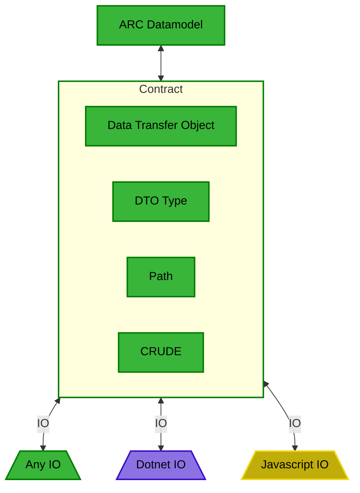
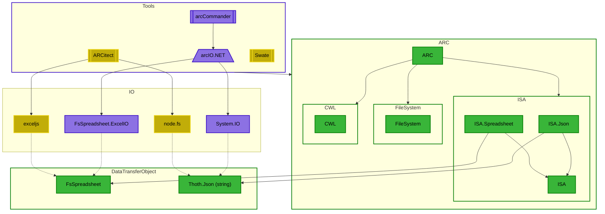
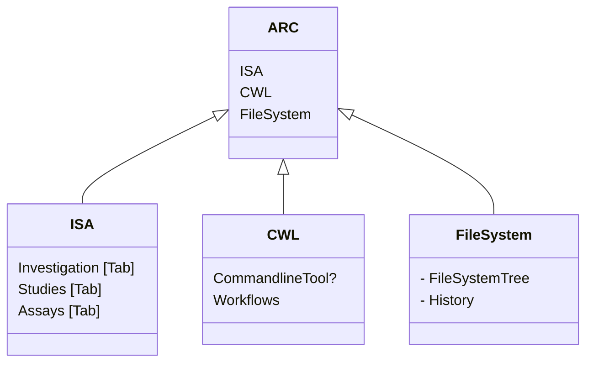
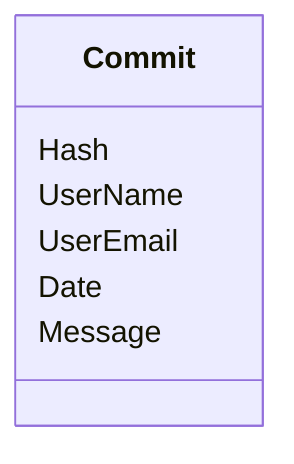
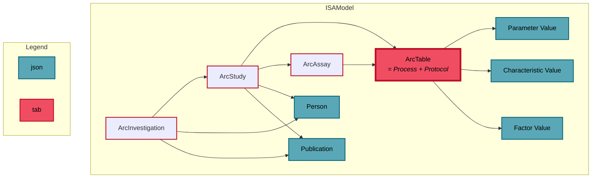

# ARCtrl
Top level ARC DataModel and API function descriptions.

- [ARCtrl](#arctrl)
  - [Jargon/Nomenclature](#jargonnomenclature)
  - [Contracts](#contracts)
  - [API Design](#api-design)
  - [Top level overview](#top-level-overview)
  - [Stack](#stack)
    - [FileSystem.DataModel](#filesystemdatamodel)
      - [FilesystemTree](#filesystemtree)
      - [History](#history)
- [Libraries](#libraries)
  - [Design choices](#design-choices)
    - [Fable compatibility as top priority](#fable-compatibility-as-top-priority)
    - [ISA datamodel](#isa-datamodel)
      - [Requirements](#requirements)
      - [Mögliche Lösungen:\*\*](#mögliche-lösungen)


## Jargon/Nomenclature

In general, a distinction is made between `DataModel`s,  `API`s, and `Tools`:
- `DataModel`s are the data structures which represent the ARC or it's respective parts in memory. They are serializable and can be used as data exchange format between tool implementations:
  - `FileSystem.DataModel`: Represents the file system structure of an ARC. All files and their path relative to the arc root folder are contained here.
  - `ISA.DataModel`: Represents the experimental metadata of the ARC that is stored in the ISA-XLSX format (investigation, studies and assays).
  - `CWL.DataModel`: Represents the workflow definitions of the ARC in the CWL format.
- `API`s are static methods on the `DataModel` types that perfrom operations on the `DataModel`s. Often, these are CRUD-like operations, and are aimed to be be composable. 
  
  **Example**: A `ARC.addAssay` function has to do several things:
  - Add a new assay to the `ISA.DataModel`
  - Add a new assay to the `FileSystem.DataModel`
  it should therefore combine the respective functions of `ISA API` and `FileSystem API` to achieve this.

- `Tools` or `Clients` are user-facing software such as Swate, ARCitect, or the ARCCommander. They should ideally compose their functionality from the `API`s and work with an in-memory representation of the ARC via `DataModel`s. There are operations such as IO for reading/writing actual files to the file system, which are not part of the `API`s, but rather part of the `Tools`.

## Contracts

The ARC stack exclusively works with the in-memory representations of the ARC. 
In order to keep the in-memory ARC datamodel and the filesystem synchronized, the ARC.Core stack uses the concept of `Contracts`.

Each contract is a single IO operation representing one change to the ARC. 
The operation contained in a contract does not use the datamodel objects, but rather uses `data transfer objects`,  which include for example the `json` representation as string and the `FsSpreadsheet` representation of the ISA.xlsx files. 

This intermediate conversion from the datamodel object to the data transfer object is important, as this step is the most complex and variable.



Besides the data transfer object, the contract also contains the path where the file system manipulation should be executed and the kind of the operation (`C`reate, `R`ead, `U`pdate, `D`elete, `E`xecute).

- **CREATE**: represents file creation on a certain location relative to the ARC root. If the file exists, it is overwritten.
   **Examples:** 
    - Create `README.md` with default content
    - Create new assay file (with associated content via `DataTransferObject.FsSpreadsheet`)
    - Create empty `.gitkeep` file
  
- **READ**: represents instructions are used to transfer information from the filesystem into the ARC datamodel. For this, the ARC API returns a `READ` contract to the user or tool, which then fulfills the contract by reading the file as a DTO from the specified path and returning the filled out contract to the API. The API then handles the inclusion of the information into the datamodel. 


  Example: initate ARC Datamodel from filesystem:
  ```mermaid
  sequenceDiagram

  participant Filesystem
  participant Client
  participant ARCAPI
  
  Note over Client,ARCAPI: API.getReadContracts
  Client->>ARCAPI: filepaths
  ARCAPI->>Client: contracts
  
  Note over Client,Filesystem: File.read
  Client->>Filesystem: filepath
  Filesystem->>Client: DTO
  
  Note over Client,ARCAPI: API.createARCfromContracts
  Client->>ARCAPI: fullfilled Contracts
  ARCAPI->>Client: ARC datamodel
  ```
  
  Fullfilling a READ contract means to read the file in the specified path   and filling the contract with the resulting DTO.
  
  ```mermaid
  flowchart TD
  
  obj[Data Transfer Object]
  
  subgraph Contract
      type[DTO Type]
      path[Path]
      crud[READ]
  end
  
  subgraph A[Fullfilled Contract]
      fobj[Data Transfer Object]
      ftype[DTO Type]
      fpath[Path]
      fcrud[READ]
  end
  
  obj --> A
  Contract --> A
  ```

- **UPDATE**: represents manipulation of **existing** files in the ARC. It is important to distinct this operation from **CREATE**, as the DataTransferObjects can not handle all possible file content. 
For example: styling, plots, etc. in spreadsheet files that are not modelled in our metadata models.
    **Examples:**
    - Add a new `Person` to an existing Study
    - Add a new row to the `AnnotationTable` in an existing assay file, while keeping user content such as plots intact.
    
- **DELETE** does exactly what you think it does.
- **EXECUTE**: represents instructions for running a cli-tool with a given name and arguments. As the ARC API does not have information about absolute paths, the tool name should be executable as is. E.g. in Windows by adding it to the PATH.

## API Design

Command syntax should be inspired by ArcCommander commands, as they are already well established and known to the power user base.
See syntax : https://nfdi4plants.github.io/arcCommander-docs/docs/01GeneralCLIStructure.html
See selection: https://nfdi4plants.github.io/arcCommander-docs/docs/02SubcommandVerbs.html

## Top level overview

In the following, the dependency graph of the proposed arcAPI toolstack can be seen:



## Stack



### FileSystem.DataModel

#### FilesystemTree

```fsharp
type FileSystem =
    | File of string
    | Folder of FileSystem list
```

#### History



- commit history metadata (literally `git log`)
  - git log --date=local --pretty=format:'%H, %an, %ae, %ad, "%s"'

# Libraries

Mockups for each library are in the `ARC` folder. They contain API/Domain stubs to draft and test the new library designs.

## Design choices

### Fable compatibility as top priority

All libraries should be Fable compatible, and produce javascript/typescript code that is ergonomic to use in a js/ts environment, therefore:
- we use classes with static members over nested modules
- we use the `[<AttachMembers>]` fable attribute for each class
  - Using overloads with the `[<AttachMembers>]` attribute will make js functions shadow itself. Never use this!
- we use the `[<NamedParams(n)>]` fable attribute for all optional parameters in static methods that use tupled, named params.
- we use `Array<'T>` for all collections in F#, since they get transpiled to native js arrays.
- we use the `[<Erase>]` fable attribute for union cases that contain data 
    ```fsharp
     [<Erase>] type X = | Y of string | Z of int
    ```
- we use the `[<StringEnum>]` for unions that contain no data (e.g.)
    ```fsharp
     [<StringEnum>] type YesOrNo = | Yes | No
    ```
    
**Example:**

```fsharp
[<AttachMembers>]
type Study = 
    {
        Identifier : string option
        Assays : Assay array option
    }

    [<NamedParams>]
    static member create (?Identifier, ?Assays : Assay array) = 
        {
            Identifier = Identifier
            Assays = Assays
        }
```

will become the following javascript code:

```javascript
export class Study extends Record {
    constructor(Identifier, Assays) {
        super();
        this.Identifier = Identifier;
        this.Assays = Assays;
    }
    static create({ Identifier, Assays }) {
        return new Study(Identifier, Assays);
    }
```

and the following typescript code:

```typescript
export class Study extends Record implements IEquatable<Study>, IComparable<Study> {
    readonly Identifier: Option<string>;
    readonly Assays: Option<Assay[]>;
    constructor(Identifier: Option<string>, Assays: Option<Assay[]>) {
        super();
        this.Identifier = Identifier;
        this.Assays = Assays;
    }
    static create({ Identifier, Assays }: {Identifier?: string, Assays?: Assay[] }): Study {
        return new Study(Identifier, Assays);
    }
```

### ISA datamodel

#### Requirements
1. MUST be parseable to a full representation of valid ISA-json
2. MUST contain structural information of isa tables (ISA-Tab and ISA-XLSX)
3. MUST allow for low level api calls (e.g. addParameterValue should be intuitive)
4. SHOULD be performant enough for use in GUI applications


#### Mögliche Lösungen:**

1. **Bestehendes ISA Schema nutzen**
    - Komplette strukturinformation via ISA comments (ISA assay spreadsheet json als comment auf Assay typ) 
    - Potentielle erweiterung für ISA schema -> ISA 2.0, schon direkt mit 1.0 compatibility lösung über comments
    - aus ISA json vs. XLSX wird ein uniformes format
    - Machen wir eh schon so -> kein extra arbeitsaufwand
    - import/export von standard ISA Json möglich
    
2. 'Structural' Metadata field on `ArcDataModel`
    - superset von ISA wird verhindert, wir können das einfach in unserem schema machen
    - problem: ISA json bleibt fallback für kommunikation mit externen tools
   


