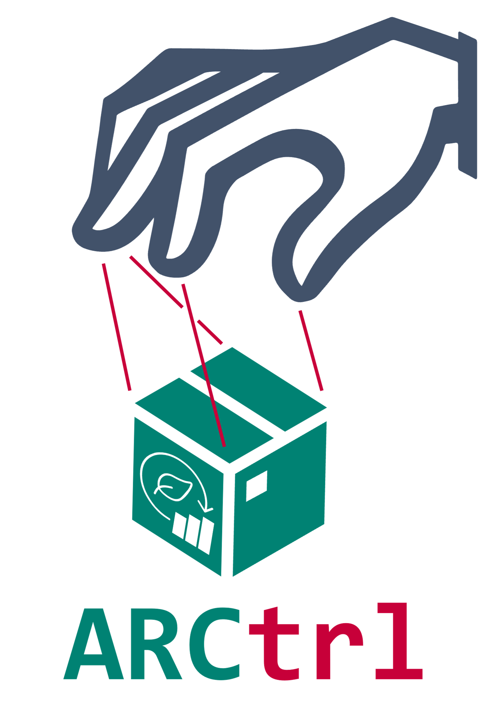

# ARCtrl

[](https://doi.org/10.5281/zenodo.15194394)

> **ARCtrl** the easy way to read, manipulate and write ARCs in __.NET__, __JavaScript__ and __Python__! ❤️

| Version | Downloads |
| :--------|-----------:|
|<a href="https://www.nuget.org/packages/ARCtrl/"></a>|<a href="https://www.nuget.org/packages/ARCtrl/"></a>|
|<a href="https://www.npmjs.com/package/@nfdi4plants/arctrl"></a>|<a href="https://www.npmjs.com/package/@nfdi4plants/arctrl"></a>|
|<a href="https://pypi.org/project/ARCtrl/"></a>|<a href="https://pypi.org/project/ARCtrl/"></a>|

## Install

#### .NET

```fsharp
#r "nuget: ARCtrl"
```

```bash
<PackageReference Include="ARCtrl" Version="1.1.0" />
```

#### JavaScript

```bash
npm i @nfdi4plants/arctrl
```

#### Python

```bash
pip install arctrl
```

## Docs

Documentation can be found [here](https://nfdi4plants.github.io/nfdi4plants.knowledgebase/arctrl/)

## Development

#### Requirements

- [nodejs and npm](https://nodejs.org/en/download)
    - verify with `node --version` (Tested with v18.16.1)
    - verify with `npm --version` (Tested with v9.2.0)
- [.NET SDK](https://dotnet.microsoft.com/en-us/download)
    - verify with `dotnet --version` (Tested with 7.0.306)
- [Python](https://www.python.org/downloads/)
    - verify with `py --version` (Tested with 3.12.2, known to work only for >=3.11)

#### Local Setup

##### Windows

On windows you can use the `setup.cmd` to run the following steps automatically!

1. Setup dotnet tools

   `dotnet tool restore`


2. Install NPM dependencies

    `npm install`

3. Setup python environment

    `py -m venv .venv`

4. Install [uv](https://docs.astral.sh/uv/) and dependencies

   1. `.\.venv\Scripts\python.exe -m pip install -U pip setuptools`
   2. `.\.venv\Scripts\python.exe -m pip install uv`
   3. `.\.venv\Scripts\python.exe -m uv pip install -r pyproject.toml --group dev`

Verify correct setup with `./build.cmd runtests` ✨

##### Linux / macOS

On unix you can use the `setup.sh` to run the following steps automatically!

1. Setup dotnet tools

   `dotnet tool restore`


2. Install NPM dependencies

    `npm install`

3. Setup python environment

    `python -m venv .venv`

4. Install [uv](https://docs.astral.sh/uv/) and dependencies

   1. `.venv/bin/python -m pip install -U pip setuptools`
   2. `.venv/bin/python -m pip install uv`
   3. `.venv/bin/python -m uv pip install -r pyproject.toml --group dev`

Verify correct setup with `bash build.sh runtests` ✨

## Branding

Feel free to reference `ARCtrl` on slides or elsewhere using our logos:

|Square | Horizontal | Vertical |
| - | - | - |
|  |  |   |

## Performance

Measured on 13th Gen Intel(R) Core(TM) i7-13800H

| Name | Description | FSharp Time (ms) | JavaScript Time (ms) | Python Time (ms) |
| --- | --- | --- | --- | --- |
| Table_GetHashCode | From a table with 1 column and 10000 rows, retrieve the Hash Code | 0 ± 0 | 0 ± 1 | 91 ± 12 |
| Table_AddDistinctRows | Add 10000 distinct rows to a table with 4 columns. | 13 ± 2 | 14 ± 4 | 119 ± 12 |
| Table_AddIdenticalRows | Add 10000 identical rows to a table with 4 columns. | 6 ± 2 | 6 ± 1 | 104 ± 6 |
| Table_AddColumnsWithDistinctValues | Add 4 columns with 10000 distinct values each. | 8 ± 3 | 10 ± 1 | 53 ± 1 |
| Table_AddColumnsWithIdenticalValues | Add 4 columns with 10000 identical values each. | 5 ± 1 | 4 ± 0 | 47 ± 1 |
| Table_fillMissingCells | For a table 6 columns and 20000 rows, where each row has one missing value, fill those values with default values. | 0 ± 0 |  2 ± 1 | 6 ± 4 |
| Table_ToJson | Serialize a table with 5 columns and 10000 rows to json, with 3 fixed and 2 variable columns. | 227 ± 64 | 68 ± 18 | 7851 ± 1411 |
| Table_ToCompressedJson | Serialize a table with 5 columns and 10000 rows to compressed json, with 3 fixed and 2 variable columns. | 147 ± 15 | 2878 ± 135 | 6303 ± 1798 |
| Assay_toJson | Parse an assay with one table with 10000 rows and 6 columns to json, with 3 fixed and 3 variable columns. | 330 ± 36 | 88 ± 9 | 12644 ± 550 |
| Assay_fromJson | Parse an assay with one table with 10000 rows and 6 columns from json, with 3 fixed and 3 variable columns. | 355 ± 66 | 61 ± 6 | 6499 ± 1068 |
| Assay_toISAJson | Parse an assay with one table with 10000 rows and 6 columns to json, with 3 fixed and 3 variable columns | 487 ± 36 | 959 ± 36 | 15618 ± 482 |
| Assay_fromISAJson | Parse an assay with one table with 10000 rows and 6 columns from json, with 3 fixed and 3 variable columns | 359 ± 29 | 706 ± 46 | 9587 ± 621 |
| Study_FromWorkbook | Parse a workbook with one study with 10000 rows and 6 columns to an ArcStudy | 29 ± 14 | 62 ± 5 | 818 ± 36 |
| Investigation_ToWorkbook_ManyStudies | Parse an investigation with 1500 studies to a workbook | 240 ± 31 | 284 ± 24 | 3657 ± 199 |
| Investigation_FromWorkbook_ManyStudies | Parse a workbook with 1500 studies to an ArcInvestigation | 127 ± 20 | 498 ± 21 | 9469 ± 412 |
| ARC_ToROCrate | Parse an ARC with one assay with 10000 rows and 6 columns to a RO-Crate metadata file. | 1431 ± 99 | 3526 ± 264 | 61224 ± 728 |