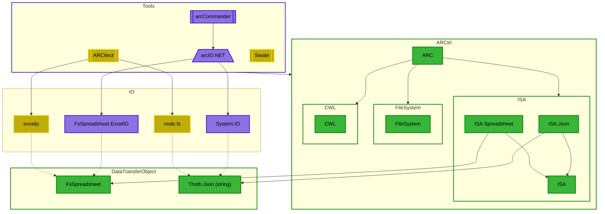
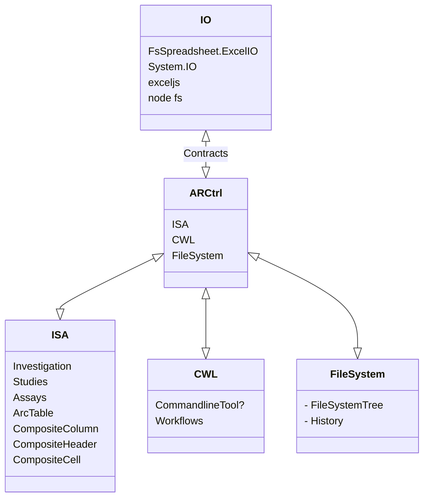

# ARCtrl
Top level ARC DataModel and API function descriptions.

- [ARCtrl](#arctrl)
  - [Jargon/Nomenclature](#jargonnomenclature)
  - [API Design](#api-design)
  - [Top level overview](#top-level-overview)
  - [Stack](#stack)
- [Libraries](#libraries)
  - [Design choices](#design-choices)
    - [Fable compatibility as top priority](#fable-compatibility-as-top-priority)

## Sub-Libraries

[ISA README.md](src/ISA/README.md) :books:

# Jargon/Nomenclature

In general, a distinction is made between `DataModel`s,  `API`s, and `Tools`:
- `DataModel`s are the data structures which represent the ARC or it's respective parts in memory. They are serializable and can be used as data exchange format between tool implementations:
  - `FileSystem`: Represents the file system structure of an ARC. All files and their path relative to the arc root folder are contained here.
  - `ISA`: Represents the experimental metadata of the ARC that is stored in the ISA-XLSX format (investigation, studies and assays).
  - `CWL`: Represents the workflow definitions of the ARC in the CWL format.
- `API`s are static methods on the `DataModel` types that perfrom operations on the `DataModel`s. Often, these are CRUD-like operations, and are aimed to be be composable. 
  
  **Example**: A `ARC.addAssay` function has to do several things:
  - Add a new assay to the `ISA`
  - Add a new assay to the `FileSystem`
  it should therefore combine the respective functions of `ISA API` and `FileSystem API` to achieve this.

- `Tools` or `Clients` are user-facing software such as Swate, ARCitect, or the ARCCommander. They should ideally compose their functionality from the `API`s and work with an in-memory representation of the ARC via `DataModel`s. There are operations such as IO for reading/writing actual files to the file system, which are not part of the `API`s, but rather part of the `Tools`.

## Local Setup

1. `dotnet tool restore`
2. `npm install` in *root*.
3. `npm install` in *src/ISA*

## API Design

Command syntax should be inspired by ArcCommander commands, as they are already well established and known to the power user base.
See syntax : https://nfdi4plants.github.io/arcCommander-docs/docs/01GeneralCLIStructure.html
See selection: https://nfdi4plants.github.io/arcCommander-docs/docs/02SubcommandVerbs.html

## Top level overview

In the following, the dependency graph of the proposed arcAPI toolstack can be seen:



## Stack



# Libraries

Mockups for each library are in the `ARC` folder. They contain API/Domain stubs to draft and test the new library designs.

## Design choices

### Fable compatibility as top priority

All libraries should be Fable compatible, and produce javascript/typescript code that is ergonomic to use in a js/ts environment, therefore:
- we use classes with static members over nested modules
- we use the `[<AttachMembers>]` fable attribute for each class
  - Using overloads with the `[<AttachMembers>]` attribute will make js functions shadow itself. Never use this!
- we use the `[<NamedParams(n)>]` fable attribute for all optional parameters in static methods that use tupled, named params.
- we use `Array<'T>` for all collections in F#, since they get transpiled to native js arrays.
- we use the `[<Erase>]` fable attribute for union cases that contain data 
    ```fsharp
     [<Erase>] type X = | Y of string | Z of int
    ```
- we use the `[<StringEnum>]` for unions that contain no data (e.g.)
    ```fsharp
     [<StringEnum>] type YesOrNo = | Yes | No
    ```
    
**Example:**

```fsharp
[<AttachMembers>]
type Study = 
    {
        Identifier : string option
        Assays : Assay array option
    }

    [<NamedParams>]
    static member create (?Identifier, ?Assays : Assay array) = 
        {
            Identifier = Identifier
            Assays = Assays
        }
```

will become the following javascript code:

```javascript
export class Study extends Record {
    constructor(Identifier, Assays) {
        super();
        this.Identifier = Identifier;
        this.Assays = Assays;
    }
    static create({ Identifier, Assays }) {
        return new Study(Identifier, Assays);
    }
```

and the following typescript code:

```typescript
export class Study extends Record implements IEquatable<Study>, IComparable<Study> {
    readonly Identifier: Option<string>;
    readonly Assays: Option<Assay[]>;
    constructor(Identifier: Option<string>, Assays: Option<Assay[]>) {
        super();
        this.Identifier = Identifier;
        this.Assays = Assays;
    }
    static create({ Identifier, Assays }: {Identifier?: string, Assays?: Assay[] }): Study {
        return new Study(Identifier, Assays);
    }
```
