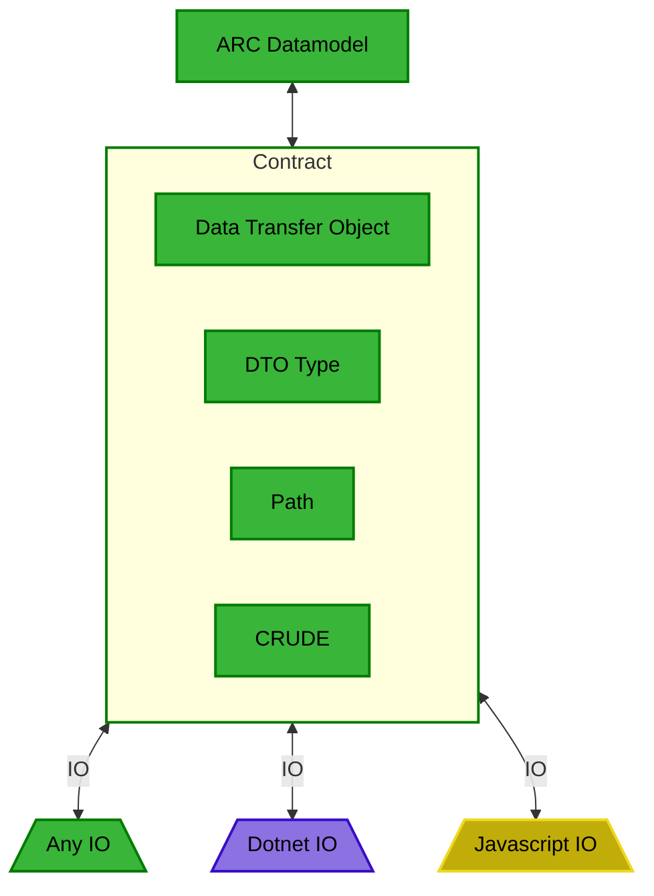

## Contracts

The ARC stack exclusively works with the in-memory representations of the ARC. 
In order to keep the in-memory ARC datamodel and the filesystem synchronized, the ARC.Core stack uses the concept of `Contracts`.

Each contract is a single IO operation representing one change to the ARC. 
The operation contained in a contract does not use the datamodel objects, but rather uses `data transfer objects`,  which include for example the `json` representation as string and the `FsSpreadsheet` representation of the ISA.xlsx files. 

This intermediate conversion from the datamodel object to the data transfer object is important, as this step is the most complex and variable.



Besides the data transfer object, the contract also contains the path where the file system manipulation should be executed and the kind of the operation (`C`reate, `R`ead, `U`pdate, `D`elete, `E`xecute).

- **CREATE**: represents file creation on a certain location relative to the ARC root. If the file exists, it is overwritten.
   **Examples:** 
    - Create `README.md` with default content
    - Create new assay file (with associated content via `DataTransferObject.FsSpreadsheet`)
    - Create empty `.gitkeep` file
  
- **READ**: represents instructions are used to transfer information from the filesystem into the ARC datamodel. For this, the ARC API returns a `READ` contract to the user or tool, which then fulfills the contract by reading the file as a DTO from the specified path and returning the filled out contract to the API. The API then handles the inclusion of the information into the datamodel. 


  Example: initate ARC Datamodel from filesystem:
  ```mermaid
  sequenceDiagram

  participant Filesystem
  participant Client
  participant ARCAPI
  
  Note over Client,ARCAPI: API.getReadContracts
  Client->>ARCAPI: filepaths
  ARCAPI->>Client: contracts
  
  Note over Client,Filesystem: File.read
  Client->>Filesystem: filepath
  Filesystem->>Client: DTO
  
  Note over Client,ARCAPI: API.createARCfromContracts
  Client->>ARCAPI: fullfilled Contracts
  ARCAPI->>Client: ARC datamodel
  ```
  
  Fullfilling a READ contract means to read the file in the specified path   and filling the contract with the resulting DTO.
  
  ```mermaid
  flowchart TD
  
  obj[Data Transfer Object]
  
  subgraph Contract
      type[DTO Type]
      path[Path]
      crud[READ]
  end
  
  subgraph A[Fullfilled Contract]
      fobj[Data Transfer Object]
      ftype[DTO Type]
      fpath[Path]
      fcrud[READ]
  end
  
  obj --> A
  Contract --> A
  ```

- **UPDATE**: represents manipulation of **existing** files in the ARC. It is important to distinct this operation from **CREATE**, as the DataTransferObjects can not handle all possible file content. 
For example: styling, plots, etc. in spreadsheet files that are not modelled in our metadata models.
    **Examples:**
    - Add a new `Person` to an existing Study
    - Add a new row to the `AnnotationTable` in an existing assay file, while keeping user content such as plots intact.
    
- **DELETE** does exactly what you think it does.
- **EXECUTE**: represents instructions for running a cli-tool with a given name and arguments. As the ARC API does not have information about absolute paths, the tool name should be executable as is. E.g. in Windows by adding it to the PATH.