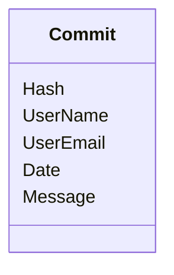

### FileSystem.DataModel

#### FilesystemTree

```fsharp
type FileSystem =
    | File of string
    | Folder of FileSystem list
```

#### History



- commit history metadata (literally `git log`)
  - git log --date=local --pretty=format:'%H, %an, %ae, %ad, "%s"'
