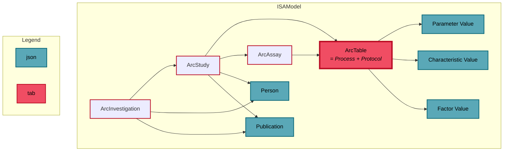

### ISA datamodel

#### Requirements
1. MUST be parseable to a full representation of valid ISA-json
2. MUST contain structural information of isa tables (ISA-Tab and ISA-XLSX)
3. MUST allow for low level api calls (e.g. addParameterValue should be intuitive)
4. SHOULD be performant enough for use in GUI applications

#### Mögliche Lösungen:**

1. **Bestehendes ISA Schema nutzen**
    - Komplette strukturinformation via ISA comments (ISA assay spreadsheet json als comment auf Assay typ) 
    - Potentielle erweiterung für ISA schema -> ISA 2.0, schon direkt mit 1.0 compatibility lösung über comments
    - aus ISA json vs. XLSX wird ein uniformes format
    - Machen wir eh schon so -> kein extra arbeitsaufwand
    - import/export von standard ISA Json möglich
    
2. 'Structural' Metadata field on `ArcDataModel`
    - superset von ISA wird verhindert, wir können das einfach in unserem schema machen
    - problem: ISA json bleibt fallback für kommunikation mit externen tools
   

