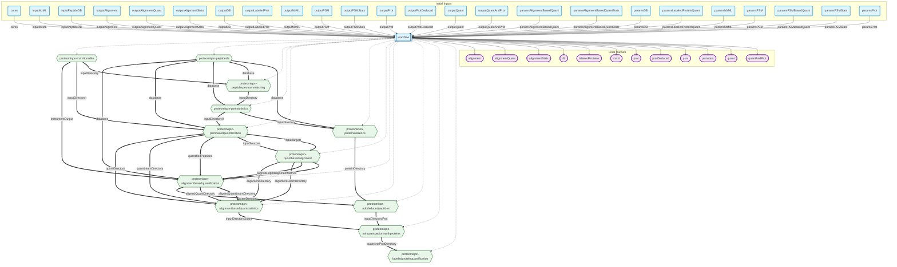

```mermaid
flowchart TD
    subgraph wg_initial_inputs[Initial Inputs]
        port_unit_run__in__cores(cores)
        port_unit_run__in__inputMzML(inputMzML)
        port_unit_run__in__inputPeptideDB(inputPeptideDB)
        port_unit_run__in__outputAlignment(outputAlignment)
        port_unit_run__in__outputAlignmentQuant(outputAlignmentQuant)
        port_unit_run__in__outputAlignmentStats(outputAlignmentStats)
        port_unit_run__in__outputDB(outputDB)
        port_unit_run__in__outputLabeledProt(outputLabeledProt)
        port_unit_run__in__outputMzML(outputMzML)
        port_unit_run__in__outputPSM(outputPSM)
        port_unit_run__in__outputPSMStats(outputPSMStats)
        port_unit_run__in__outputProt(outputProt)
        port_unit_run__in__outputProtDeduced(outputProtDeduced)
        port_unit_run__in__outputQuant(outputQuant)
        port_unit_run__in__outputQuantAndProt(outputQuantAndProt)
        port_unit_run__in__paramsAlignmentBasedQuant(paramsAlignmentBasedQuant)
        port_unit_run__in__paramsAlignmentBasedQuantStats(paramsAlignmentBasedQuantStats)
        port_unit_run__in__paramsDB(paramsDB)
        port_unit_run__in__paramsLabeledProteinQuant(paramsLabeledProteinQuant)
        port_unit_run__in__paramsMzML(paramsMzML)
        port_unit_run__in__paramsPSM(paramsPSM)
        port_unit_run__in__paramsPSMBasedQuant(paramsPSMBasedQuant)
        port_unit_run__in__paramsPSMStats(paramsPSMStats)
        port_unit_run__in__paramsProt(paramsProt)
    end
    unit_run__Workflow__run[[workflow]]
    unit_run__Workflow__run__AddDeducedPeptides__run{{proteomiqon-adddeducedpeptides}}
    unit_run__Workflow__run__AlignmentBasedQuantStatistics__run{{proteomiqon-alignmentbasedquantstatistics}}
    unit_run__Workflow__run__AlignmentBasedQuantification__run{{proteomiqon-alignmentbasedquantification}}
    unit_run__Workflow__run__JoinQuantPepIonsWithProteins__run{{proteomiqon-joinquantpepionswithproteins}}
    unit_run__Workflow__run__LabeledProteinQuantification__run{{proteomiqon-labeledproteinquantification}}
    unit_run__Workflow__run__MzMLToMzlite__run{{proteomiqon-mzmltomzlite}}
    unit_run__Workflow__run__PSMBasedQuantification__run{{proteomiqon-psmbasedquantification}}
    unit_run__Workflow__run__PSMStatistics__run{{proteomiqon-psmstatistics}}
    unit_run__Workflow__run__PeptideDB__run{{proteomiqon-peptidedb}}
    unit_run__Workflow__run__PeptideSpectrumMatching__run{{proteomiqon-peptidespectrummatching}}
    unit_run__Workflow__run__ProteinInference__run{{proteomiqon-proteininference}}
    unit_run__Workflow__run__QuantBasedAlignment__run{{proteomiqon-quantbasedalignment}}
    subgraph wg_final_outputs[Final Outputs]
        port_unit_run__out__alignment([alignment])
        port_unit_run__out__alignmentQuant([alignmentQuant])
        port_unit_run__out__alignmentStats([alignmentStats])
        port_unit_run__out__db([db])
        port_unit_run__out__labeledProteins([labeledProteins])
        port_unit_run__out__mzml([mzml])
        port_unit_run__out__prot([prot])
        port_unit_run__out__protDeduced([protDeduced])
        port_unit_run__out__psm([psm])
        port_unit_run__out__psmstats([psmstats])
        port_unit_run__out__quant([quant])
        port_unit_run__out__quantAndProt([quantAndProt])
    end
    unit_run__Workflow__run-.->unit_run__Workflow__run__MzMLToMzlite__run
    unit_run__Workflow__run-.->unit_run__Workflow__run__PeptideDB__run
    unit_run__Workflow__run-.->unit_run__Workflow__run__PeptideSpectrumMatching__run
    unit_run__Workflow__run-.->unit_run__Workflow__run__PSMStatistics__run
    unit_run__Workflow__run-.->unit_run__Workflow__run__PSMBasedQuantification__run
    unit_run__Workflow__run-.->unit_run__Workflow__run__ProteinInference__run
    unit_run__Workflow__run-.->unit_run__Workflow__run__QuantBasedAlignment__run
    unit_run__Workflow__run-.->unit_run__Workflow__run__AlignmentBasedQuantification__run
    unit_run__Workflow__run-.->unit_run__Workflow__run__AlignmentBasedQuantStatistics__run
    unit_run__Workflow__run-.->unit_run__Workflow__run__AddDeducedPeptides__run
    unit_run__Workflow__run-.->unit_run__Workflow__run__JoinQuantPepIonsWithProteins__run
    unit_run__Workflow__run-.->unit_run__Workflow__run__LabeledProteinQuantification__run
    port_unit_run__in__cores-->|cores|unit_run__Workflow__run
    port_unit_run__in__inputMzML-->|inputMzML|unit_run__Workflow__run
    port_unit_run__in__inputPeptideDB-->|inputPeptideDB|unit_run__Workflow__run
    port_unit_run__in__outputAlignment-->|outputAlignment|unit_run__Workflow__run
    port_unit_run__in__outputAlignmentQuant-->|outputAlignmentQuant|unit_run__Workflow__run
    port_unit_run__in__outputAlignmentStats-->|outputAlignmentStats|unit_run__Workflow__run
    port_unit_run__in__outputDB-->|outputDB|unit_run__Workflow__run
    port_unit_run__in__outputLabeledProt-->|outputLabeledProt|unit_run__Workflow__run
    port_unit_run__in__outputMzML-->|outputMzML|unit_run__Workflow__run
    port_unit_run__in__outputPSM-->|outputPSM|unit_run__Workflow__run
    port_unit_run__in__outputPSMStats-->|outputPSMStats|unit_run__Workflow__run
    port_unit_run__in__outputProt-->|outputProt|unit_run__Workflow__run
    port_unit_run__in__outputProtDeduced-->|outputProtDeduced|unit_run__Workflow__run
    port_unit_run__in__outputQuant-->|outputQuant|unit_run__Workflow__run
    port_unit_run__in__outputQuantAndProt-->|outputQuantAndProt|unit_run__Workflow__run
    port_unit_run__in__paramsAlignmentBasedQuant-->|paramsAlignmentBasedQuant|unit_run__Workflow__run
    port_unit_run__in__paramsAlignmentBasedQuantStats-->|paramsAlignmentBasedQuantStats|unit_run__Workflow__run
    port_unit_run__in__paramsDB-->|paramsDB|unit_run__Workflow__run
    port_unit_run__in__paramsLabeledProteinQuant-->|paramsLabeledProteinQuant|unit_run__Workflow__run
    port_unit_run__in__paramsMzML-->|paramsMzML|unit_run__Workflow__run
    port_unit_run__in__paramsPSM-->|paramsPSM|unit_run__Workflow__run
    port_unit_run__in__paramsPSMBasedQuant-->|paramsPSMBasedQuant|unit_run__Workflow__run
    port_unit_run__in__paramsPSMStats-->|paramsPSMStats|unit_run__Workflow__run
    port_unit_run__in__paramsProt-->|paramsProt|unit_run__Workflow__run
    unit_run__Workflow__run-->port_unit_run__out__alignment
    unit_run__Workflow__run-->port_unit_run__out__alignmentQuant
    unit_run__Workflow__run-->port_unit_run__out__alignmentStats
    unit_run__Workflow__run-->port_unit_run__out__db
    unit_run__Workflow__run-->port_unit_run__out__labeledProteins
    unit_run__Workflow__run-->port_unit_run__out__mzml
    unit_run__Workflow__run-->port_unit_run__out__prot
    unit_run__Workflow__run-->port_unit_run__out__protDeduced
    unit_run__Workflow__run-->port_unit_run__out__psm
    unit_run__Workflow__run-->port_unit_run__out__psmstats
    unit_run__Workflow__run-->port_unit_run__out__quant
    unit_run__Workflow__run-->port_unit_run__out__quantAndProt
    unit_run__Workflow__run__AddDeducedPeptides__run==>|inputDirectoryProt|unit_run__Workflow__run__JoinQuantPepIonsWithProteins__run
    unit_run__Workflow__run__AlignmentBasedQuantStatistics__run==>|inputDirectoryQuant|unit_run__Workflow__run__JoinQuantPepIonsWithProteins__run
    unit_run__Workflow__run__AlignmentBasedQuantification__run==>|quantDirectory|unit_run__Workflow__run__AddDeducedPeptides__run
    unit_run__Workflow__run__AlignmentBasedQuantification__run==>|alignedQuantDirectory|unit_run__Workflow__run__AlignmentBasedQuantStatistics__run
    unit_run__Workflow__run__AlignmentBasedQuantification__run==>|alignedQuantLearnDirectory|unit_run__Workflow__run__AlignmentBasedQuantStatistics__run
    unit_run__Workflow__run__JoinQuantPepIonsWithProteins__run==>|quantAndProtDirectory|unit_run__Workflow__run__LabeledProteinQuantification__run
    unit_run__Workflow__run__MzMLToMzlite__run==>|instrumentOutput|unit_run__Workflow__run__AlignmentBasedQuantification__run
    unit_run__Workflow__run__MzMLToMzlite__run==>|inputDirectoryI|unit_run__Workflow__run__PSMBasedQuantification__run
    unit_run__Workflow__run__MzMLToMzlite__run==>|inputDirectory|unit_run__Workflow__run__PeptideSpectrumMatching__run
    unit_run__Workflow__run__PSMBasedQuantification__run==>|quantDirectory|unit_run__Workflow__run__AlignmentBasedQuantStatistics__run
    unit_run__Workflow__run__PSMBasedQuantification__run==>|quantLearnDirectory|unit_run__Workflow__run__AlignmentBasedQuantStatistics__run
    unit_run__Workflow__run__PSMBasedQuantification__run==>|quantifiedPeptides|unit_run__Workflow__run__AlignmentBasedQuantification__run
    unit_run__Workflow__run__PSMBasedQuantification__run==>|inputSources|unit_run__Workflow__run__QuantBasedAlignment__run
    unit_run__Workflow__run__PSMBasedQuantification__run==>|inputTargets|unit_run__Workflow__run__QuantBasedAlignment__run
    unit_run__Workflow__run__PSMStatistics__run==>|inputDirectoryII|unit_run__Workflow__run__PSMBasedQuantification__run
    unit_run__Workflow__run__PSMStatistics__run==>|inputDirectory|unit_run__Workflow__run__ProteinInference__run
    unit_run__Workflow__run__PeptideDB__run==>|database|unit_run__Workflow__run__AlignmentBasedQuantification__run
    unit_run__Workflow__run__PeptideDB__run==>|database|unit_run__Workflow__run__PSMBasedQuantification__run
    unit_run__Workflow__run__PeptideDB__run==>|database|unit_run__Workflow__run__PSMStatistics__run
    unit_run__Workflow__run__PeptideDB__run==>|database|unit_run__Workflow__run__PeptideSpectrumMatching__run
    unit_run__Workflow__run__PeptideDB__run==>|database|unit_run__Workflow__run__ProteinInference__run
    unit_run__Workflow__run__PeptideSpectrumMatching__run==>|inputDirectory|unit_run__Workflow__run__PSMStatistics__run
    unit_run__Workflow__run__ProteinInference__run==>|proteinDirectory|unit_run__Workflow__run__AddDeducedPeptides__run
    unit_run__Workflow__run__QuantBasedAlignment__run==>|alignmentDirectory|unit_run__Workflow__run__AlignmentBasedQuantStatistics__run
    unit_run__Workflow__run__QuantBasedAlignment__run==>|alignmentLearnDirectory|unit_run__Workflow__run__AlignmentBasedQuantStatistics__run
    unit_run__Workflow__run__QuantBasedAlignment__run==>|alignedPeptides|unit_run__Workflow__run__AlignmentBasedQuantification__run
    unit_run__Workflow__run__QuantBasedAlignment__run==>|alignmentMetrics|unit_run__Workflow__run__AlignmentBasedQuantification__run
    classDef wg_workflow fill:#dff4ff,stroke:#246fa8,stroke-width:2px;
    classDef wg_tool fill:#e8f5e9,stroke:#2e7d32,stroke-width:2px;
    classDef wg_expression fill:#fff3e0,stroke:#e65100,stroke-width:2px;
    classDef wg_unresolved fill:#ffebee,stroke:#c62828,stroke-width:2px,stroke-dasharray:5 5;
    classDef wg_initial_input fill:#e1f5fe,stroke:#0288d1,stroke-width:2px;
    classDef wg_final_output fill:#f3e5f5,stroke:#7b1fa2,stroke-width:2px;
    class unit_run__Workflow__run wg_workflow;
    class unit_run__Workflow__run__AddDeducedPeptides__run,unit_run__Workflow__run__AlignmentBasedQuantStatistics__run,unit_run__Workflow__run__AlignmentBasedQuantification__run,unit_run__Workflow__run__JoinQuantPepIonsWithProteins__run,unit_run__Workflow__run__LabeledProteinQuantification__run,unit_run__Workflow__run__MzMLToMzlite__run,unit_run__Workflow__run__PSMBasedQuantification__run,unit_run__Workflow__run__PSMStatistics__run,unit_run__Workflow__run__PeptideDB__run,unit_run__Workflow__run__PeptideSpectrumMatching__run,unit_run__Workflow__run__ProteinInference__run,unit_run__Workflow__run__QuantBasedAlignment__run wg_tool;
    class port_unit_run__in__cores,port_unit_run__in__inputMzML,port_unit_run__in__inputPeptideDB,port_unit_run__in__outputAlignment,port_unit_run__in__outputAlignmentQuant,port_unit_run__in__outputAlignmentStats,port_unit_run__in__outputDB,port_unit_run__in__outputLabeledProt,port_unit_run__in__outputMzML,port_unit_run__in__outputPSM,port_unit_run__in__outputPSMStats,port_unit_run__in__outputProt,port_unit_run__in__outputProtDeduced,port_unit_run__in__outputQuant,port_unit_run__in__outputQuantAndProt,port_unit_run__in__paramsAlignmentBasedQuant,port_unit_run__in__paramsAlignmentBasedQuantStats,port_unit_run__in__paramsDB,port_unit_run__in__paramsLabeledProteinQuant,port_unit_run__in__paramsMzML,port_unit_run__in__paramsPSM,port_unit_run__in__paramsPSMBasedQuant,port_unit_run__in__paramsPSMStats,port_unit_run__in__paramsProt wg_initial_input;
    class port_unit_run__out__alignment,port_unit_run__out__alignmentQuant,port_unit_run__out__alignmentStats,port_unit_run__out__db,port_unit_run__out__labeledProteins,port_unit_run__out__mzml,port_unit_run__out__prot,port_unit_run__out__protDeduced,port_unit_run__out__psm,port_unit_run__out__psmstats,port_unit_run__out__quant,port_unit_run__out__quantAndProt wg_final_output;

```