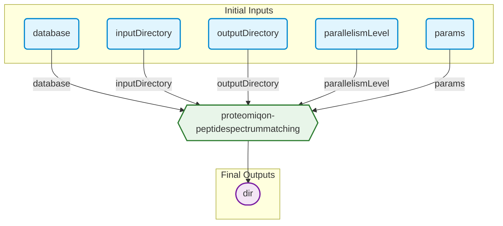

```mermaid
flowchart TD
    subgraph wg_initial_inputs[Initial Inputs]
        port_unit_proteomiqon_peptidespectrummatching__in__database(database)
        port_unit_proteomiqon_peptidespectrummatching__in__inputDirectory(inputDirectory)
        port_unit_proteomiqon_peptidespectrummatching__in__outputDirectory(outputDirectory)
        port_unit_proteomiqon_peptidespectrummatching__in__parallelismLevel(parallelismLevel)
        port_unit_proteomiqon_peptidespectrummatching__in__params(params)
    end
    unit_proteomiqon_peptidespectrummatching{{proteomiqon-peptidespectrummatching}}
    subgraph wg_final_outputs[Final Outputs]
        port_unit_proteomiqon_peptidespectrummatching__out__dir([dir])
    end
    port_unit_proteomiqon_peptidespectrummatching__in__database-->|database|unit_proteomiqon_peptidespectrummatching
    port_unit_proteomiqon_peptidespectrummatching__in__inputDirectory-->|inputDirectory|unit_proteomiqon_peptidespectrummatching
    port_unit_proteomiqon_peptidespectrummatching__in__outputDirectory-->|outputDirectory|unit_proteomiqon_peptidespectrummatching
    port_unit_proteomiqon_peptidespectrummatching__in__parallelismLevel-->|parallelismLevel|unit_proteomiqon_peptidespectrummatching
    port_unit_proteomiqon_peptidespectrummatching__in__params-->|params|unit_proteomiqon_peptidespectrummatching
    unit_proteomiqon_peptidespectrummatching-->port_unit_proteomiqon_peptidespectrummatching__out__dir
    classDef wg_workflow fill:#dff4ff,stroke:#246fa8,stroke-width:2px;
    classDef wg_tool fill:#e8f5e9,stroke:#2e7d32,stroke-width:2px;
    classDef wg_expression fill:#fff3e0,stroke:#e65100,stroke-width:2px;
    classDef wg_unresolved fill:#ffebee,stroke:#c62828,stroke-width:2px,stroke-dasharray:5 5;
    classDef wg_initial_input fill:#e1f5fe,stroke:#0288d1,stroke-width:2px;
    classDef wg_final_output fill:#f3e5f5,stroke:#7b1fa2,stroke-width:2px;
    class unit_proteomiqon_peptidespectrummatching wg_tool;
    class port_unit_proteomiqon_peptidespectrummatching__in__database,port_unit_proteomiqon_peptidespectrummatching__in__inputDirectory,port_unit_proteomiqon_peptidespectrummatching__in__outputDirectory,port_unit_proteomiqon_peptidespectrummatching__in__parallelismLevel,port_unit_proteomiqon_peptidespectrummatching__in__params wg_initial_input;
    class port_unit_proteomiqon_peptidespectrummatching__out__dir wg_final_output;

```